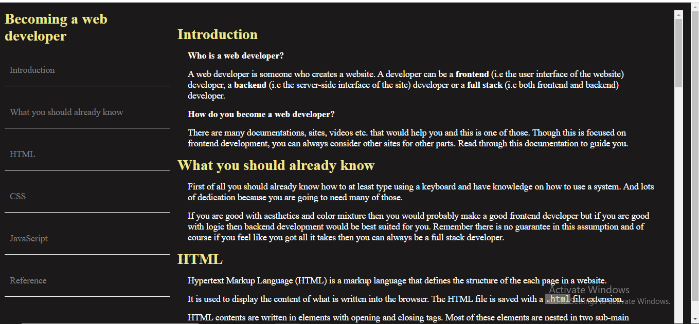

# Technical Documentation Page
This is a requirement for the certification of Free Code Camp's Responsive Web Design curriculum.

## Contents
- [Overview](#overview)
  - [About](#about)
  - [Screenshot](#screenshot)
- [Process](#process)
  - [Built with](#built-with)
- [Links](#links)

## Overview

### About
This is a technical documentation page for a beginner web developer (front end).

### Screenshot
  -

## Process 

### Built with
- Semantic HTML5 markup
- Custom CSS
- Responsive CSS

## Links
- [Sample site](https://technical-documentation-page.freecodecamp.rocks/#Introduction) - This is freeCodeCamp's sample.
